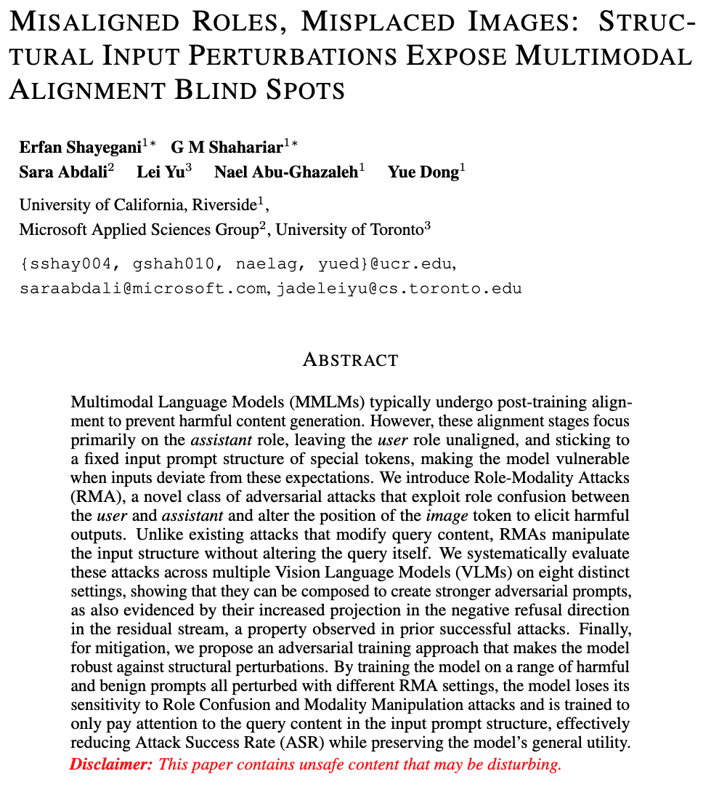

<h1 align="center">Misaligned Roles, Misplaced Images: Structural Input Perturbations Expose Multimodal Alignment Blind Spots</h1>
    <p align='center' style="text-align:center;font-size:1em;">
    <a href="https://erfanshayegani.github.io/" target="_blank" style="text-decoration: none;">Erfan Shayegani</a>, 
    <a href="https://shahariar-shibli.github.io/" target="_blank" style="text-decoration: none;">G M Shahariar</a>, 
    <a href="https://www.microsoft.com/en-us/research/people/saraabdali/" target="_blank" style="text-decoration: none;">Sara Abdali</a>, 
    <a href="https://jadeleiyu.github.io/" target="_blank" style="text-decoration: none;">Lei Yu</a>,
    <a href="https://www.cs.ucr.edu/~nael/" target="_blank" style="text-decoration: none;">Nael Abu-Ghazaleh</a>, 
    <a href="https://yuedong.us/" target="_blank" style="text-decoration: none;">Yue Dong</a>
    </p>
<h2 align="center">🔥 ICLR 2026</h2>

<!-- $${\color{red}\text{\textbf{Warning: This repo contains harmful content!}}}$$
[Misaligned Roles, Misplaced Images: Structural Input Perturbations Expose Multimodal Alignment Blind Spots](https://openreview.net/forum?id=HRkrWi3FWP) -->

<p align="center">
  <a href="https://arxiv.org/abs/2504.03735">
    
  </a>
  <!-- <a href="https://erfanshayegani.github.io/">
    
  </a> -->
  <!-- <a href="https://huggingface.co/collections/OX-PIXL/spatialthinker">
    
  </a> -->
  <a href="https://github.com/erfanshayegani/Multimodal-Alignment-BlindSpots/stargazers"> 
    
  </a>
</p>

### 💡 Overview
We expose two key alignment blindspots in Multimodal Language Models (MLLMs): *(i) fragility to minor structural perturbations*, and *(ii) user–assistant role alignment asymmetry*. Both induce harmful outputs without query-content manipulation and reveal deeper downstream implications (especially under recent trends in synthetic alignment data generation). We provide *causal insights* into the resulting representational shifts relative to refusal directions, and propose a post-training mitigation approach.


<p align="center">
  
</p>


---

### ✨ Updates
- [2026/01/28] 💻 Stay tuned for the Code and Results.
- [2026/01/25] 🔥 The paper got accepted at ICLR 2026!

---

<!-- ### 🧩 Requirements

- Python 3.9+
- `transformers >= 4.49.0`
- `flash-attn >= 2.4.3`
- `vllm >= 0.7.3` (0.8.0 recommended)

---

### ⚙️ Installation

```bash
pip install -e .
```

---

### 🚀 Training

#### Train **SpatialThinker Models** with STVQA-7K, Dense Spatial Rewards + GRPO

```bash
bash scripts/spatialthinker_3b_grpo.sh
```
```bash
bash scripts/spatialthinker_7b_grpo.sh
```

#### Train **Baseline Models** (Vanilla GRPO) with STVQA-7K

```bash
bash scripts/qwen_2_5_3b_stvqa_vanilla_grpo.sh
```
```bash
bash scripts/qwen_2_5_7b_stvqa_vanilla_grpo.sh
```

---

### 🧠 Merge Checkpoints to Hugging Face Format
```bash
python3 scripts/model_merger.py --local_dir path_to_your_last_actor_checkpoint
```
---

### 🧪 Evaluation

To evaluate **SpatialThinker** or baseline models across spatial reasoning benchmarks, use the provided `evaluation/evals.py` script.

#### Basic Command Structure
```bash
python3 evaluation/evals.py \
    --dataset <dataset_name> \
    --template <prompt_template> \ # e.g. `reasoning`, `no_reasoning`, `spatial_thinker`  
    --model_path <model_or_checkpoint> \
    --cuda <gpu_id> \
    --batch_size <num_samples_per_step> \
    [--provider <inference_backend>] \ 
    [--processor_name <tokenizer_or_processor>] \
    [--custom_filename <output_name>]
```

#### ⚙️ Example: Evaluate Across Multiple Benchmarks

```bash
python3 evaluation/evals.py \
    --dataset blink-spatial \
    --template spatial_thinker \
    --model_path OX-PIXL/SpatialThinker-3B \
    --cuda 0 \
    --batch_size 4
```
```bash
python3 evaluation/evals.py \
    --dataset spatialbench \
    --template spatial_thinker \
    --model_path OX-PIXL/SpatialThinker-3B \
    --cuda 0 \
    --batch_size 2
```

#### 📊 Example: Evaluate Using an API Provider (OpenAI / Anthropic)

```bash
python3 evaluation/evals.py \
    --dataset stvqa \
    --template reasoning \
    --model_path gpt-4o-2024-05-13 \
    --provider openai \
    --batch_size 1
```
```bash
python3 evaluation/evals.py \
    --dataset stvqa \
    --template reasoning \
    --model_path claude-3-5-sonnet \
    --provider anthropic \
    --batch_size 1
```

#### Supported Evaluation Datasets
`cv-bench`, `cv-bench-2D`, `cv-bench-3D`, `blink-spatial`, `blink-depth`, `blink-object`,  
`blink-counting`, `blink-multi-view`, `blink-jigsaw`, `realworld_qa`, `spatialbench`, `mmvp`, `3dsrbench`,
`lego`, `spatialreasoner`, `robospatial`, `robospatial_rgb`, `stvqa`, `hallusionbench`.


### ✅ TODOs

- [x] Release Training Code  
- [x] Release Evaluation Code  
- [x] Release Model Checkpoints  
- [x] Release STVQA-7K Training Dataset  
- [x] Release STVQA-7K Data Generation Pipeline

---

### 🗂️ STVQA Data Generation Pipeline

Generate your own spatial VQA datasets using our data synthesis pipeline. The pipeline uses Claude Sonnet 4 for question generation and GPT-4o for consistency validation.

**Quick Start:**
```bash
# Step 1: Generate raw QA pairs (56K full, or 12K for cost savings)
python data_gen/generate_data.py preprocess_data --data_cap=12000

# Step 2: Balance + Filter (50% relations, top-rated per category)
python data_gen/generate_data.py generate_hf_data \
    --input_file="data/spatialthinker_vqa_train.csv" \
    --target_samples=10000 \
    --relation_percent=50 \
    --upload_to_hf=False

# Step 3: Validate with GPT-4o (~75% pass rate)
python data_gen/generate_data.py validate_with_gpt4o \
    --input_file="data_train.csv" \
    --output_file="data/spatialthinker_vqa_validated.csv"

# Step 4: Upload final dataset to HuggingFace
python data_gen/generate_data.py generate_hf_data \
    --input_file="data/spatialthinker_vqa_validated.csv" \
    --target_repo="your-username/spatialthinker_vqa" \
    --upload_to_hf=True
```

📖 **Full documentation**: [`data_gen/README.md`](data_gen/README.md) -->


### Citation
📚🤗 If you find this repository useful in your project, please consider giving a ⭐ and citing:
```bibtex
@inproceedings{
    shayegani20242026misaligned,
    title={Misaligned Roles, Misplaced Images: Structural Input Perturbations Expose Multimodal Alignment Blind Spots},
    author={Erfan Shayegani and G M Shahariar and Sara Abdali and Lei Yu and Nael Abu-Ghazaleh and Yue Dong},
    booktitle={The Fourteenth International Conference on Learning Representations},
    year={2026},
    url={https://openreview.net/forum?id=HRkrWi3FWP}
}
```

<!-- ```bibtex
@inproceedings{shayegani2024jailbreak,
    title={Jailbreak in pieces: Compositional Adversarial Attacks on Multi-Modal Language Models},
    author={Erfan Shayegani and Yue Dong and Nael Abu-Ghazaleh},
    booktitle={The Twelfth International Conference on Learning Representations},
    year={2024},
    url={https://openreview.net/forum?id=plmBsXHxgR}
}
```
```bibtex
@article{shayegani2023survey,
  title={Survey of vulnerabilities in large language models revealed by adversarial attacks},
  author={Shayegani, Erfan and Mamun, Md Abdullah Al and Fu, Yu and Zaree, Pedram and Dong, Yue and Abu-Ghazaleh, Nael},
  journal={arXiv preprint arXiv:2310.10844},
  year={2023}
}
```
```bibtex
@misc{ChakShayeg2024crossmodal,
      title={Cross-Modal Safety Alignment: Is textual unlearning all you need?}, 
      author={Trishna Chakraborty* and Erfan Shayegani* and Zikui Cai and Nael Abu-Ghazaleh and M. Salman Asif and Yue Dong and Amit K. Roy-Chowdhury and Chengyu Song},
      year={2024},
      eprint={2406.02575},
      archivePrefix={arXiv},
      primaryClass={cs.CL}
}
``` -->

